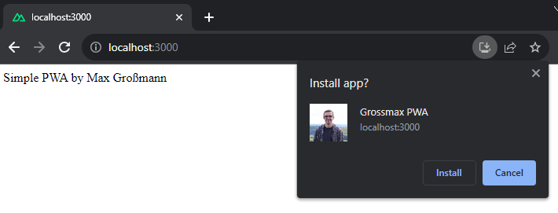

# Nuxt 3 PWA Sample

This is a sample project for creating a **progressive web app** with **nuxt 3**.
Feel free to fork or reuse the project. :)

## Install instructions

1. Install dependencies: `npm i`
2. Run dev server: `npm run dev`
3. Open browser at http://localhost:3000
4. Install app :)

## Credits

* Shoutout to [Jahid Anowar](https://github.com/jahidanowar/nuxt3-pwa). I used [his tutorial](https://www.youtube.com/watch?v=vJ-WAAWiGNA) as a basis.
* I used this [pwa-icon-generator](https://tools.crawlink.com/tools/pwa-icon-generator/) to generate the pwa icons. 
